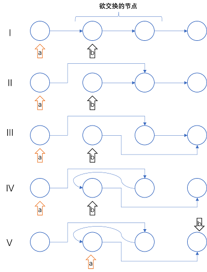

## #1 两数之和

> [题目描述](https://leetcode.cn/problems/two-sum/)

给定的数字不超过10^4^，可以使用暴力（双层循环），复杂度为$O(n^2)$。

**优于$O(n^2)$的做法**

使用一个`std::set`保存$target-nums[i]$的结果，然后对`nums`中的每一个元素在`set::set`中进行查询，查询成功即说明已经找到了结果，这个方法的复杂度为$O(n \cdot log n)$。

- **更快的方法**：使用哈希表替换`std::set`，此时的复杂度为$O(n)$。


## #2 两数相加

> [题目描述](https://leetcode.cn/problems/add-two-numbers/)

高精度加法模板，复杂度为$O(len)$，$len$是两个链表中较长的链表的长度。


## #3 无重复字符的最长子串

> [题目描述](https://leetcode.cn/problems/longest-substring-without-repeating-characters/)

维护一个布尔数组`have`，记录当前的子串中有哪些字符已经出现，如果当前欲添加的字符已经在子串中出现过，那么记录当前子串的长度，然后从头部开始删除字符，直到冲突字符被删去。

伪代码：

```cpp
int head=0;
bool have[256];
int ans=0;

for(int i=0;i<s.length();i++) {
    if(have[s[i]]==false)
        have[s[i]]=true;
    else {
        // 记录子串长度i-head+1, 如果值大于ans, 则覆盖ans
        // 使have[s[head]]=false, 同时head++, 直到s[head-1]=s[i]
    }
}
```

复杂度为$O(len)$，$len$是原字符串的长度。


## #5 最长回文子串

> [题目描述](https://leetcode.cn/problems/longest-palindromic-substring/)

以原字符串的每个字符和字符间的“空隙”作为中心，向两侧进行扫描，即可得到局部最长回文子串（选定中心为锚点），这些回文子串中最长的一个即为答案。

扫描部分的伪代码：

```cpp
// l和r的初始值可以用来标定中心
// 扫描
while(s[l]==s[r] && l>=0 && r<s.length())
    l--, r++;
// 此时，r-l-1即为这次扫描得到的最长回文子串
```

复杂度为$O(n^2)$，$n$为原字符串的长度。

**常数优化**

显然，当目前最优值$best$和中心位置$c$存在关系$best \geq 2(n-c+1)$时，不可能再得到长于$best$的子串，此时即可停止扫描。


## #6 N 字形变换

> [题目描述](https://leetcode.cn/problems/zigzag-conversion/)

按照要求构造字符串即可，构造时按照：
$$
1, \, 2, \, \cdots , \, n-1, \, n, \, n-1, \, n-2, \, \cdots , \, 2, \, 1, \, 2, \, \cdots
$$

的顺序进行填充即可得到最终的结果。

**特殊情况**：当$n=1$时，直接返回原字符串即可。

复杂度为$O(len)$，$len$为原字符串的长度。


## #7 整数反转

> [题目描述](https://leetcode.cn/problems/reverse-integer/)

题目中要求不使用64位整数进行处理，则最好的办法是使用无符号整数`unsigned`处理数值部分，然后使用一个额外的布尔变量记录原数字的符号。

为了防止溢出，对于小于0的数字使用如下代码进行处理：

```c
if(x<0) {
    t=-1;
    use=((unsigned)(~x))+1;
}
```

此后再通过取余和取整运算对处理后的数字进行转换即可。

需要注意的是，在转换过程中可能出现溢出，因此，需要进行溢出判断。

**简单的溢出判断方法**：如果一个数字$n$经过运算$f(n)$后溢出，那么在绝大多数情况下$f^{-1} \big(f(n) \big) \ne n$成立。

复杂度为$O(b)$，$b$为数字的位数。


## #8 字符串转换整数 (atoi)

> [题目描述](https://leetcode.cn/problems/string-to-integer-atoi/)

按照给出的流程处理即可。

复杂度为$O(len)$，$len$为原字符串的长度。


## #9 回文数

> [题目描述](https://leetcode.cn/problems/palindrome-number/)

显然，所有的负数都不是回文数，因此当输入小于0时，直接返回`false`。

对于正数，有以下两种处理思路：

- **思路1**：将数字转化成一个字符串，按照字符串查找回文的方法查找结果。
- **思路2**：利用取整/取余运算获取每位上的数字，再进行回文比对。

本质上两种思路相同。

复杂度为$O(b)$，$b$为数字的位数。


## #10 正则表达式匹配

> [题目描述](https://leetcode.cn/problems/regular-expression-matching/)

首先使用如下结构体：

```cpp
struct MItem {
    char c;
    bool rep;
};
```

对正则表达式进行处理，其中，`c`表示要匹配的字符，`rep`表示这个字符是否经过了`*`修饰。

随后定义`match`函数：

```cpp
bool match(string& s, vector<MItem>& mp, int sp, int pp);
```

其中，`s`为将要进行匹配的串，`mp`为处理后的表达式序列，`sp`表示`s`当前的处理位置，`pp`表示`mp`当前的处理位置。

**设定终止条件**

显然，`match`的终止条件有以下几个：

- 当 $sp=s.end$ 且 $pp=mp.end$ 时，匹配成功
- 当 $pp=mp.end$ 但 $sp \ne s.end$ 时，匹配失败
- 当 $mp_{pp}.rep=false$ 且 $sp=s.end$ 时，匹配失败
- 当 $mp_{pp}.c$ 不为点号，且 $mp_{pp}.c \ne s_{sp}$ 时，匹配失败

**匹配过程**

在当前执行的`match`未终止时：

- 对于$mp_{pp}.rep=false$ 的情况，直接进行匹配，然后进行下一步匹配`match(s, mp, sp+1, pp+1)`
- 对于$mp_{pp}.rep=true$ 的情况，对每种可能的情况都进行匹配，然后进行下一步匹配`match(s, mp, sp+i, pp+1)`，`i`的取值范围为0至最多能匹配的字符个数，其中，任意一种情况匹配成功都认为这次匹配成功

复杂度为$O(n!)$，$n$ 与表达式和原字符串的长度正相关。


## #11 盛最多水的容器

> [题目描述](https://leetcode.cn/problems/container-with-most-water/)

显然，对于当前找到的一个容器$\lbrace l, \, r, \, len \rbrace$ ，它的容量为$ min(l, \, r) \cdot len $ ，此时，如果我们缩小 $ len $ 的值，同时保留 $l$ 和 $r$ 中较小的一个，那么得到的新的容器容量一定小于当前容器。

因此，如果我们想在缩小 $len$ 的同时得到一个更大的容器，只能保留 $l$ 和 $r$ 中较大的一个。

通过上述的分析，我们得到了以下策略：

- **起始条件**：选取最左端和最右端的两个值作为$\lbrace l, \, r \rbrace$，此时 $len=array.size$ 
- **迭代**：不断向右移动左端点，向左移动右端点，每步中总是选择值更小的端点进行移动，且总是只移动1步，即 $len-1$，如果当前得到的容器的容量大于最大的容器，则进行记录
- **终止**：当 $len=0$ 时停止，此时记录的最大容器容量即为答案

伪代码如下：

```cpp
int best=0;
int left=0, right=size-1;
while(left!=right) {
    best=max(best, (right-left)*min(array[left], array[right]));
    if(array[left]>array[right]) right--;
    	else left++;
}
```

复杂度为$O(n)$，$n$ 为线的数量。


## #14 最长公共前缀

> [题目描述](https://leetcode.cn/problems/longest-common-prefix/)

暴力，轮流扫描每个字符串，值相同则继续扫描，不同则停止并返回结果。

复杂度为$O(n \cdot len)$，其中 $n$ 为字符串的数量，$len$ 为所有字符串中最短的字符串的长度。


## #17 电话号码的字母组合

> [题目描述](https://leetcode.cn/problems/letter-combinations-of-a-phone-number/)

暴力深搜，先构造一个数字与字母的映射表，然后根据映射表搜索出所有可能的结果。

复杂度为$O(3^{n})$，其中 $n$ 为输入的数字的个数。


## #19 删除链表的倒数第 N 个结点

> [题目描述](https://leetcode.cn/problems/remove-nth-node-from-end-of-list/)

由于是单向链表，因此我们需要先递归至链表的尾部，再借此确定节点是倒数第几个节点。

伪代码如下：

```cpp
int DFS(ListNode* pos, int target) {
    if(pos==nullptr) return 0;
    int pn=DFS(pos->next)+1;
    if(pn==target) 
        // 删除这个节点
    return pn;
}
```

复杂度为$O(n)$，$n$ 为链表的长度。


## #20 有效的括号

> [题目描述](https://leetcode.cn/problems/valid-parentheses/)

构造一个栈，当读取到左括号时进行入栈，读取到右括号则出栈，如果栈顶元素与需要出栈的元素不匹配，则不是有效括号，当所有元素均成功出栈且无剩余时，则是有效括号。

复杂度为$O(n)$，$n$ 为括号串的长度。


## #22 括号生成

> [题目描述](https://leetcode.cn/problems/generate-parentheses/)

通过递归构造。

结束条件为：

- 未闭合的左括号数量为0，且左括号数量为要求数量时结束，此时得到了一个符合条件的括号串。

递归方式为：

- 当这一步中未闭合的左括号数量不为0时，闭合一个左括号（添加一个右括号），进行下一步递归。
- 当这一步中的左括号总数小于要求数量时，添加一个左括号，进行下一步递归。

复杂度为$O(2^{n})$，其中 $n$ 为要求的括号对数量。


## #23 合并 K 个升序链表

> [题目描述](https://leetcode.cn/problems/merge-k-sorted-lists/)

初始时，构造$K$个指针指向$K$个链表的头部，从这$K$个元素中找出最小的元素，加入到新的链表中，同时这个指针指向链表的下一个节点，以此类推，直到所有的指针都指向链表的尾部。

复杂度为$O(K \cdot M)$，其中$K$表示链表的数量，$M = \sum ^{K-1} _{i=0} L _{i}$，$L _{i}$为第$i$个链表的长度。

**更优算法：堆优化**

将初始指向的$K$个元素加入到小根堆中，取堆头，将对应的指针移向下一个节点，将新的元素加入到堆中。

此时复杂度为$O(M \cdot log \, K)$。


## #24 两两交换链表中的节点

> [题目描述](https://leetcode.cn/problems/swap-nodes-in-pairs/)

***所有涉及改变链表中节点位置的题目，都有一个核心问题：各个节点的指向节点（next）该如何改变***

画图解决：

 

每一步对应的代码：

```cpp
// 初始状态 I
a->next=b->next; // II
b->next=a->next->next; //III
a->next->next=b; //IV
a=b, b=a->next; //V
```

复杂度为$O(n)$，其中 $n$ 为链表的长度。


##  #25 K 个一组翻转链表

> [题目描述](https://leetcode.cn/problems/reverse-nodes-in-k-group/)

***核心问题与#24相同***

先找出每组的边界，对每个分组进行链表翻转，然后对每个分组的头尾进行类似**#24**的处理。

时间复杂度为$O(n)$，其中 $n$ 表示链表的长度。

**偷懒方法**

构造一个新的链表，构建新链表总是比原地修改简单。

时间复杂度不变，但是需要额外的$O(n)$的空间。
